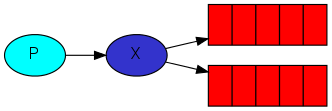

# RabbitMQ

## 1. Hello World

## 2. Worker Queues

### Round-robin dispatching

Mặc định RabbitMQ sẽ chia tuần tự message cho danh sách consonmers.  Việc distributing messages này gọi là round-robin. Cần lưu ý round-robin khi scale consumer.

### Message acknowledgment

Khi RabbitMQ chuyển một message đến consumer thì nó sẽ ngay lập tức đánh dấu đã xoá lên message đó. Trường hợp có sự cố như consumer chết khi đang xử lý thì message đấy sẽ bị mất. Để khắc phục vấn đề này RabbitMQ hỗ trợ `message acknowledgments`. Ack (acknowledgment) sẽ sendback từ consumer đến RabbitMQ để nói message đã được received, processed, khi đấy RabbitMQ mới được xoá nó.

Nếu consumer chết (như đóng chanel, mất connection, hoặc TCP mất kết nối) thì ack sẽ không sendback, khi đó RabbitMQ sẽ hiểu là message chưa processed xong và message sẽ được đưa trở lại queue. Khi đấy message sẽ không bị mất. Timeout mặc định là 30 phút, bạn có thể [tăng thời gian timeout](https://www.rabbitmq.com/consumers.html#acknowledgement-timeout) tại đây

Khi dùng `Acknowledgment` ưu điểm là *không mất message*, nhưng cũng có nhược điểm là *tốn rất nhiều bộ nhớ (RAM)*

### Message durability

Chúng ta đã học được cách làm cho các message không bị mất khi *consumer chết*. Nhưng nếu RabbitMQ server dừng thì message vẫn sẽ bị mất.

Khi RabbitMQ thoát hoặc crashes, nó sẽ quên hết queues và messages. Để không mất message trong trường hợp này sau khi restart RabbitMQ, chúng ta sẽ đánh dấu `durable` cho cả queues và messages. Chúng ta cũng cần đánh dấu messages là `persistent`

### Fair (Phiên) Dispatch

Case thực tế sẽ có những dispatch không mong muốn như sau. Chúng ta có 2 consumers, khi tất cả message lẻ rất nặng và message chẳn lại rất nhẹ. Khi đó consumer lẻ sẽ luôn rất bận trong khi consumer chẳn lại rất nhàn. Bởi vì RabbitMQ sẽ dispatch message vào trong queue theo cơ chế `round-robin dispatch` nó sẽ không biết được số unacknowledged message của consumer nên sẽ dispatch mỗi n-th message đến n-th consumer.

Bạn có thể setting `prefetchCount = 1` trong method `BasicQos`, để nói cho RabbitMQ biết là trong một thời điểm không có nhiều hơn một message trong một consumer. Hay nói cách khác là không dispatch một new message cho đến khi consumer processed và acknowledged message trước đó. Thay vào đó, RabbitMQ sẽ dispatch new message đến consumer tiếp theo nếu nó không bận.

Nếu tất cả consumer đều bạn thì bạn nên cân nhắc tăng thêm số consumers hoặc sử dụng một chiến lược khác.

## 3. Publish/Subscrible

### Exchanges

Producer không bao giờ chuyển trực tiếp các messages đến queue. Thay vào đó producer sẽ chuyển messages đến `exchange`.

Exchange gồm có các kiểu: `direct`, `topic`, `headers`, `fanout`.

### Temporary queues

### Bindings

Mối quan hệ giửa exchange và queue chúng ta gọi là `binding`.

## 4. Routing

Routing là việc điều hướng các message đến đúng các subscribe theo cấu hình.

### Bindings

Như đã biết từ mục trước `bindings` là mối liên hệ giữa exchange và queue. Hay đơn giản queue là thừa hưởng các message từ exchange.

Tham số `routingKey` phụ thuộc vào loại exchange. Với `fanout` exchanges nó đơn giản sẽ bỏ qua giá trị của `routingKey`

### Direct exchange

Khi sử dụng `direct` exchange thì message đến queues sẽ phải exactly matches với `routingKey` của message. Nếu message không exactly matches thì sẽ discarded.

### Multiple bindings

