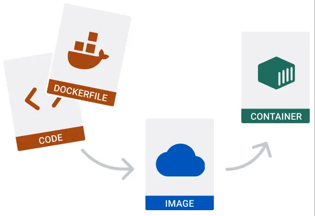

# How do I run a container?

Trong bài hướng dẫn này (walkthrough), bạn sẽ học những bước cơ bản để building an image và running một container cho chính mình. Bài hướng dẫn này sử dụng Node.js application, nhưng bạn không nhất thiết phải biết về Node.js



## Step 1: Get the sample application

```git
$ git clone https://github.com/docker/welcome-to-docker
```

## Step 2: View the Dockerfile in your project folder

Để chạy code của bạn trong container, cơ bản nhất là bạn cần là một `Dockerfile`. Một `Dockerfile` sẽ trình bày những cái gì bạn cần đưa vào trong một container.

## Step 3: Build your first image

Bạn luôn cần một image để run container. Trong terminal, chạy câu lệnh sau để build image.

```shell
$ cd /path/to/welcome-to-docker/
$ docker build -t welcome-to-docker .
```
`-t` là flag tags để đặt tên cho image, trong câu lệnh trên thì tên sẽ là `welcome-to-docker`. Và `.` để chỉ nơi chứ `Dockerfile`, trong trường hợp này là cùng path.

## Step 4: Run your contianer

## Step 5: View the frontend


## Reference

https://docs.docker.com/guides/walkthroughs/run-a-container/