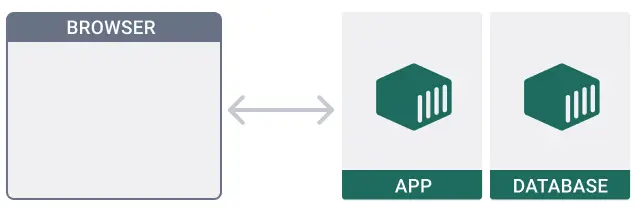

# Run multi-container applications

Nếu bạn đã hoàn thành bài hướng dẫn [How do i run a container](02-run-a-container.md), bạn đã học được cách để chạy duy nhất mỗi 1 container. Hay tưởng tượng lớn hơn làm cách nào bạn có thể start multiple containers trong một single command. Đó là tool được gọi là Docker Compose.

## Step 1: Get the sample application

```git
$ git clone https://github.com/docker/multi-container-app
```

Sample application là một todo application sử dụng ExpressJs và Nodejs. Application sẽ lưu trữ tất cả todos trong MongoDB database.



## Step 2: Dig into the Compose file

Xem các files trong sample application. Chú ý bạn sẽ thấy có một file `compose.yaml`. File này sẽ nói với Docker cách để chạy application của bạn.

## Step 3: Run the application

Run multi-container application, mở một terminal và run các lệnh sau trong đường dẫn `*/multi-container-app`

```linux
$ cd */multi-container-app
```

```docker
$ docker compose up -d
```

`-d` flag nói cho Docker Compose là run in detached mode.

## Step 4: View the frontend and add todos

## Step 5: Develop in your containers

Khi bạn developing với Docker, bạn có thể cần automatically update và preview các services đang chạy khi bạn sửa code. Bạn có thể sử dụng Docker Compose Watch để làm việc đó.

```docker
$ docker compose watch
```

## Step 6: Delete everything and start over

Bạn cần lưu trữ lại file Compose ở bất kỳ nơi nào, khi đó bạn có thể dễ dàng xóa và restartover lại.


## Reference

https://docs.docker.com/guides/walkthroughs/multi-container-apps/