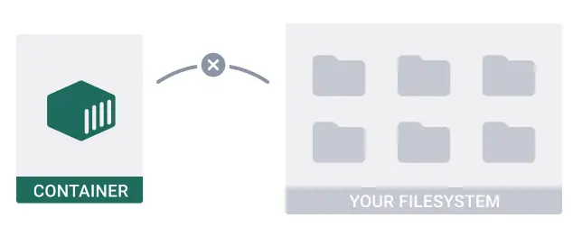
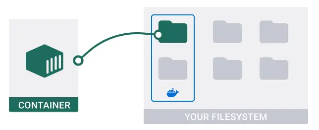

# Persist container data

Trong bài hướng dẫn này sẽ chỉ bạn cách duy trì dữ liệu (persist data) giữa các containers.

Docker tách rời tất cả nội dung, code, và dữ liệu trong một container từ filesystem trên local. Khi bạn delete một container, Docker sẽ deletes all tất cả nội dung trong container đó.



Đôi khi, bạn muốn duy trì dữ liệu (persist data) của một container khi được tạo, Như _todo_ application, bạn có thể sử dụng volumes.

## Step 1: Get the sample application

```git
$ git clone https://github.com/docker/multi-container-app
```

## Step 2: Add a volume to persist data

Để duy trì dữ liệu (persist data) sau khi delete một container, ta sử dụng một `volume`. Một `volume` là một location ở trong local filesystem của bạn, nó sẽ được quản lý tự động bởi Docker Desktop.



Thêm một volume vào project, bạn mở file `compose.yaml`, và uncomment các dòng sau:

```docker
todo-database:
    # ...
    volumes:
      - database:/data/db

# ...
volumes:
  database:
```

Phần tử `volumes` ở dưới `todo-database` sẽ nói cho Compose là mount một `volume` có tên là `database` tại đường dẫn `/data/db` bên trong container todo-database service

Phần tử `volumes` ngoài cùng defines và configures một `volume` có tên là `database` có thể sử dụng cho bấy kỳ services nào trong file Compose.

## Step 3: Run the application

```docker
$ cd cd /path/to/multi-container-app/
```

```docker
$ docker compose up -d
```

## Step 4: View the frontend and add todos

## Summary

Trong bài hướng dẫn này, bạn đã duy trì (persist data) giữa các container bằng cách sử dụng `volume`. Bạn có thể sử dụng nó để persist và share data cho các containers bị tách rời một cách phù hợp

## Reference

https://docs.docker.com/guides/walkthroughs/persist-data/
