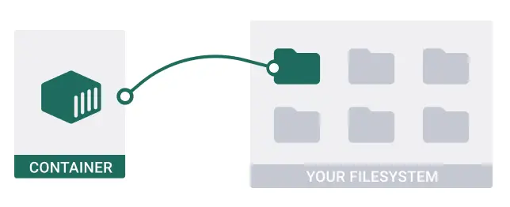

# Access a local folder from a container

Trong bài hướng dẫn này sẽ chỉ cho bạn cách access a local folder từ container.

Docker tách rời tất cả content, code, và data trong một container từ local filesystem của bạn. Mặc định, container không thử truy cập các directories trong local filesystem.


Nhưng đôi khi bạn muốn truy cập một directory từ local filesystem của bạn. Các làm nó, là bạn user dụng **bind mounts**.

## Step 1: Get the sample application

```git
$ git clone https://github.com/docker/bindmount-apps
```
## Step 2: Add a bind mount using Compose

Thêm một bind mount từ access data trên system của bạn đến một container. Một bind mount sẽ share một directory của bạn đến host's filesystem trong containter.



Trong file `compose.yaml`, bạn uncomment đoạn code sau:

```docker
todo-app:
    # ...
    volumes:
      - ./app:/usr/src/app
      - /usr/src/app/node_modules
```

Phần tử `volume` nói với Compose, mount local folder `./app` đến `/usr/src/app` trong container của `todo-app` service. Khi thực hành, bind mount overwrites static contents của `/usr/src/app` directory trong container và tạo ra cái được gọi là development container. Dòng thứ hai,  `/usr/src/app/node_modules` chặn bind mount overiting container `node_modules` directory, để bảo toàn các packages install trong container.

## Step 3: Run the application

Mở terminal và chạy các lệnh sau:

```docker
$ cd /path/to/bindmount-apps/
```

```docker
$ docker compose up -d
```

## Step 4: Develop the application

Bây giờ, bạn có một ưu điểm của container's environment là bạn có thể phát triển ứng dụng của bạn trên local system của bạn. Bất kỳ khi nào bạn thay đổi ứng dụng trên local system của bạn đều được ánh xạ vào trong container. Trong local directory của bạn, mở `app/views/todo.ejs` trong editor, update chuổi `Enter you task`, và save file. Sau đó refresh page bạn sẽ thấy sự thay đổi.

## Summary

Trong bài hướng dẫn này, bạn đã thêm một bind mount để access một local folder từ một container. Bạn có thể sử dụng nó để phát triển nhanh hơn mà không cần rebuild container của bạn mỗi khi update code.

Các thông tin liên quan:

- Tìm hiểu sau về [bind mounts](https://docs.docker.com/storage/bind-mounts/)
- Học các sử dụng bind mount trong Compose trong [Compose file reference](https://docs.docker.com/compose/compose-file/)
- Khám phá cách sử dụng bind mounts thông qua CLI trong [Docker run reference](https://docs.docker.com/engine/reference/commandline/container_run/#mount)

## Reference

https://docs.docker.com/guides/walkthroughs/access-local-folder/