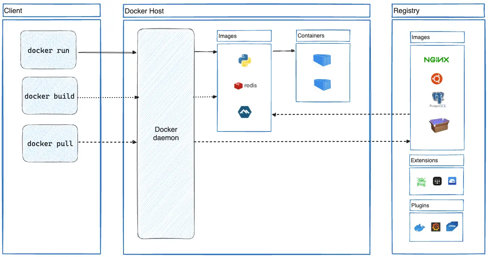

# Docker overview

Docker là một nền tảng mở (open platform) dành cho developing, shipping, and running applications. Docker cho phép tách rời từ ứng dụng (application )đến hạ tầng (infrastruce), giúp cho việc phân phối phần (deliver) mền nhanh hơn. Với Docker, bạn có thể quản lý hạ tầng trông cũng giống như bạn quản lý ứng dụng. Bởi vì các lợi ít  Docker mạng lại các phương thức cho shipping, testing, và deploy code, nên bạn sẽ giám đáng kể thời gian khi writing code và running nó trên môi trường production.

## The Docker platform

Docker cung cấp các gói và run ứng dụng trong một môi trường gần như riêng biệt (loosely isolated) được gọi là `container`. Được tách biệt và an toàn nên bạn có thể run đồng thời nhiều ứng dụng trên cùng một host. Containers là một lightweight và chứa mọi thứ cần thiết để chạy ứng dụng, bạn không cần phải phải cài đặt trên host. Bạn có thể share containers của mình, và tất cả mọi người được share container của bạn có thể get container và run.

Docker cung cấp tooling và một platform để quản lý vòng đời (lifecycle) container của bạn:

- Phát triển ứng dụng của bạn và nó sẽ được hỗ trợ các thành phần sử dụng container.
- Container thích hợp với việc phân tán (distribute) và testing theo các đơn vị ứng dụng của bạn
- Khi bạn đã sẵn sàng deploy ứng dụng lên môi trường production,  như một container or một orchestrated service. Nó làm việc trên môi trường production giống như là một local data center, a cloud provider, hoặc một hybrid hoặc cả hai.

## What can i use Docker for?

### Fast, consistent delivery of your applications

Vòng đời (lifecycle) phát triển của Docker streamlines cho phép các developes làm việc với môi trường chuẩn (standardized) khi sử dụng containers local để cung cấp cho applications và services của bạn. Containers là luồng làm việc (workflow) tuyệt nhất (great) dành cho continuous integration and continuous delivery (CI/CD).

Ví dụ một số kịch bẩn sau (scenario):

- Các developers của bạn write code và shared công việc của họ với các đồng nghiệp (colleagues) sử dụng Docker containers.
- Họ sử dụng Docker để push applications của mình vào trong môi trường test để test tự động (automated test) hoặc test thử công (manual test).
- Khi developers tìm ra bugs, họ sẽ fix trên môi trường development và redeploy application lên môi trường test để tiếp tục testing và validation.
- Khi quá trình testing hoàn thành, bàn giao bản fix cho khách hàng (customer) đơn giản là pushing image đã updated lên môi trường production.

### Responsive deployment and scaling

Nền tảng Docker's container-base cho phép highly portable workloads (giống như có thể chạy được trên nhiều hạ tầng). Docker containers có thể run trên local laptop của một developer, trên physical hoặc virtual machines trong một data center, trên cloud providers, hoặc một mixture environments.

Docker's portability và lightweight làm cho dễ dàng quản lý workloads, scaling up hoặc tearing down applications và services theo nhu cầu kinh doanh gần như real time.

### Running more workloads on the same hardware

Docker là lightweight and fast. Nó cung cấp một chi phí hợp lý (cost-effective) thay thế cho hypervisor-based visual machines, nên bạn có thể sử dụng nhiều hơn để phục vụ cho mục đích kinh doanh của bạn. Docker là hoàn hỏa dành cho việc deployments các ưng dụng vừa và nhỏ lên môi trường có tài nguyên hạn chế, nơi bạn sẽ làm được nhiều việc hơn với một ít tài nguyên.

## Docker architecture

Docker sử dụng một client-server architecture. Docker client talks to the Docker daemon, Docker daemon sẽ làm những việc năng (heavy lifting) như building, running, and distrubuting Docker container của bạn. Docker client và Docker daemon có thể chạy trên cùng một system, hoặc bạn có thể connect một Docker client đến remote Docker daemo. Docker client và Docker daemon sử dụng REST API để giao tiếp với nhau, over UNIX sockets hoặc một network interface. Nói cách khác Docker client là Docker Compose, do đó bạn sẽ làm việc với nhiều applications được chứa trong tập hợp của nhiều containers.

### The Docker daemon

Docker daemon (`dockerd`) listens Docker API requests và manages Docker objects như các images, containers, networks, và volumnes. Một Docker daemon có thể giao tiếp (communicate) với các Docker daemon khác để manage Docker services.

### The Docker client

Docker client (`docker`) là sử dụng giao diện người dùng (user interface) là cách cơ bản nhất để nhiều Docker giao tiếp với nhau. Khi bạn sử dụng lệnh (commands) như `docker run`, client sẽ send lệnh đến `dockerd`, Docker daemon sẽ mang chúng ra ngoài. Lệnh `docker` sử dụng Docker API. Docker client có thể giao tiếp với nhiều hơn một Docker daemon. 

### Docker Desktop

Docker Desktop dễ dàng được cài đặt trên các môi trường Mac, Windows hoặc Linux, cho phép bạn build và shared containerized applications and microservices. Docker Desktop bao gồm Docker daemon (`dockerd`), Docker client (`docker`), Dockder Compose, Docker Content Trust, Kubernetes, và Credential Helper.

### Docker registries

Một Docker registry là nơi lưu trữ Docker Images. Docker Hub là một publish registry để mọi người có thể sử dụng, và Docker Hub được set là tính năng mặc định khi Docker tìm (looks) images.

Khi bạn sử dụng lệnh `docker pull` hoặc `docker push`. Khi pull image, Docker pull image theo cấu hình registry đã đăng ký trước đó của bạn. Còn khi bạn push image, Docker sẽ pushes image theo cấu hình registry theo cấu hình đã đăng ký trước đó của bạn.

### Docker objects

Khi bạn sử dụng Docker, bạn sẽ tạo và sử dụng images, containers, networks, volumes, plugins, và orthe object. Phần này sẽ tóm tắt một số objects sau:

#### Images

Image là một template chỉ được phép đọc (read-only) với các tập chỉ lệnh (instructions) dành cho tạo một Docker container. Thông  thường, một image được based trên một orthe image cộng với một số customization. Ví dụ, Bạn có thể build một image được based trên `ubuntu` image, nhưng sẽ install thêm Apache web server và application của bạn, nó sẽ tốt hơn là đi cấu hình các phần chi tiết cần thiết để bạn chạy application của mình.

Bạn có thể tạo một images cho chính mình hoặc bạn sử dụng các image đã được người khác tạo và published vào trong registry. Build image của bạn, tạo một Dockerfile với các syntax đơn giản định nghĩa các bước cần thiết để tạo ra một image và chạy nó. Mỗi chỉ lệnh (instruction) trong một Dockerfile sẽ tạo ra một layer trong image. Khi bạn thay đổi Dockerfile và rebuild lại image, thì chỉ có những  layer thay đổi mới được rebuild. Đây là lý do làm cho images rất lighweight, small, and fast, khi bạn so sánh với các kỹ thuật ảo hóa khác.

#### Containers

## Reference link
https://docs.docker.com/get-started/overview/
